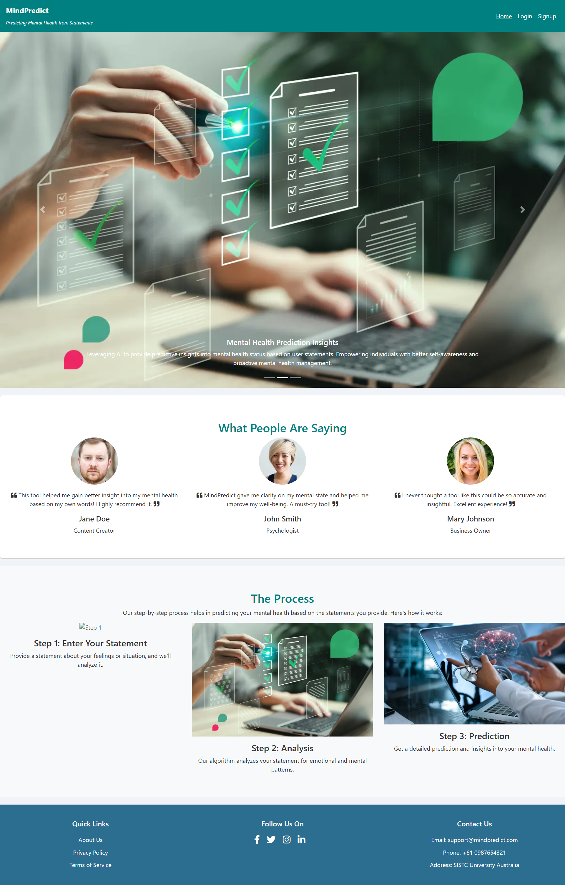
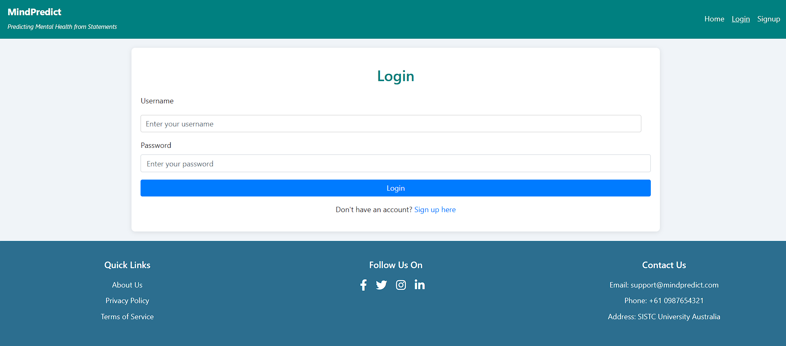
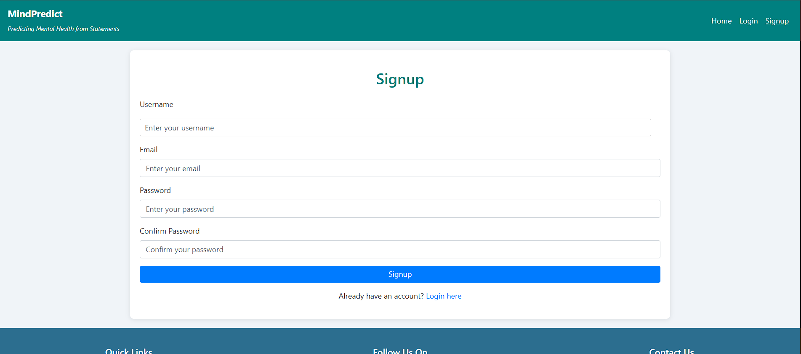
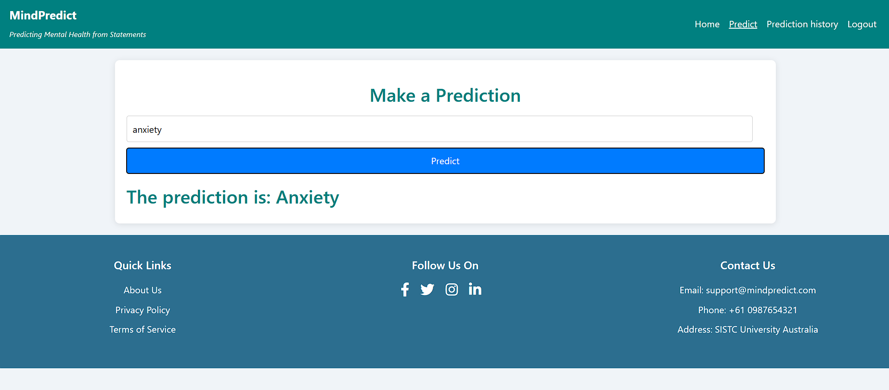
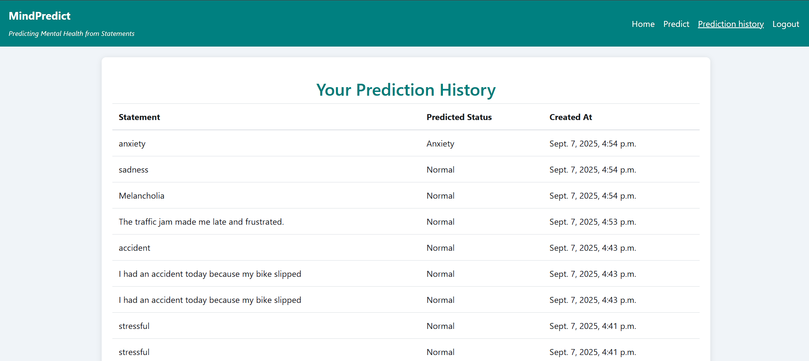

# 🧠 MindPredict AI: Mental Health Statement Analysis Tool

[](https://www.python.org/)
[](https://djangoproject.com/)
[](https://scikit-learn.org/)
[](https://getbootstrap.com/)
[](LICENSE)

A Django-powered web application that leverages machine learning to predict mental health sentiment from user-provided statements.

## 🌟 Overview

MindPredict AI is an intelligent web application designed to offer users insight into their mental well-being. By entering a statement about their feelings or current situation, the application uses a pre-trained machine learning model to analyze the text and provide a predicted mental health status (e.g., positive, negative, neutral).

The project features a secure user authentication system, allowing users to track their prediction history over time in a personal and private dashboard.

## ✨ Key Features

- 🤖 **AI-Powered Prediction**: Utilizes a Scikit-learn based machine learning model to analyze and classify text
- 🔐 **Secure User Authentication**: Complete user management system with secure signup, login, and logout functionality
- 📈 **Personalized Prediction History**: Logged-in users can view detailed history of all past statements and corresponding predictions
- ⚡ **Dynamic & Asynchronous**: Smooth prediction handling using JavaScript's fetch API for seamless user experience
- 📱 **Responsive Design**: Built with Bootstrap for full responsiveness across desktops, tablets, and mobile devices
- 🗂️ **Clean Architecture**: Follows Django's best practices for scalable and maintainable project structure

## 🛠️ Technology Stack

**Backend:**
- Python 3.8+
- Django 4.x
- SQLite3 (development database)

**Machine Learning:**
- Scikit-learn
- Joblib
- NumPy

**Frontend:**
- HTML5
- CSS3
- Bootstrap 4
- JavaScript (ES6+)

**Deployment:**
- WSGI

## 📸 Application Screenshots

### Homepage

*Engaging homepage with image carousel and navigation*

### Authentication Pages
| Login Page | Signup Page |
|------------|-------------|
|  |  |
| *Simple and secure login form* | *User-friendly registration interface* |

### Core Functionality
| Prediction Page | Prediction History |
|-----------------|-------------------|
|  |  |
| *Clean interface for statement input and AI analysis* | *Comprehensive history of past predictions and analysis* |

> **Note**: Add your screenshot files to a `screenshots/` folder in your repository root, with filenames: `home.png`, `login.png`, `signup.png`, `prediction.png`, and `history.png`.

## ⚙️ How It Works

The application follows a simple yet powerful process:

1. **User Input**: Registered user navigates to the "Predict" page and enters a statement
2. **Backend Processing**: Statement is sent to Django backend via asynchronous request
3. **Text Vectorization**: Pre-trained TfidfVectorizer transforms text into numerical feature vector
4. **ML Model Inference**: Vectorized input is fed into the trained model.pkl for prediction
5. **Store & Display**: Prediction result is saved to user's profile and instantly displayed

## 🚀 Getting Started

### Prerequisites

- Python 3.8 or higher
- pip (Python package installer)
- Git

### Installation

1. **Clone the Repository**
   ```bash
   git clone https://github.com/your-username/mentalhealthpredictor.git
   cd mentalhealthpredictor
   ```

2. **Set Up Virtual Environment**
   
   **macOS/Linux:**
   ```bash
   python3 -m venv venv
   source venv/bin/activate
   ```
   
   **Windows:**
   ```bash
   python -m venv venv
   .\venv\Scripts\activate
   ```

3. **Install Dependencies**
   ```bash
   pip install -r requirements.txt
   ```
   
   *Note: If requirements.txt is not present, install manually:*
   ```bash
   pip install django scikit-learn numpy joblib
   ```

4. **Set Up Database**
   ```bash
   python manage.py migrate
   ```

5. **Create Superuser (Optional)**
   ```bash
   python manage.py createsuperuser
   ```

6. **Run Development Server**
   ```bash
   python manage.py runserver
   ```

7. **Access Application**
   
   Open your browser and navigate to: `http://127.0.0.1:8000/`

## 📁 Project Structure

```
mentalhealthpredictor/
├── manage.py
├── requirements.txt
├── model.pkl                 # Pre-trained ML model
├── db.sqlite3               # SQLite database
├── screenshots/             # Application screenshots
│   ├── home.png
│   ├── login.png
│   ├── signup.png
│   ├── prediction.png
│   └── history.png
├── your_app/
│   ├── models.py           # Database models
│   ├── views.py            # Application views
│   ├── urls.py             # URL routing
│   └── templates/          # HTML templates
│       ├── home.html
│       ├── predict.html
│       ├── prediction_history.html
│       ├── login.html
│       └── signup.html
└── static/                 # CSS, JS, images
```

## 🔧 Configuration

### Environment Variables

Create a `.env` file in the root directory:

```env
SECRET_KEY=your_secret_key_here
DEBUG=True
ALLOWED_HOSTS=localhost,127.0.0.1
```

### Database Configuration

For production, consider using PostgreSQL:

```python
DATABASES = {
    'default': {
        'ENGINE': 'django.db.backends.postgresql',
        'NAME': 'mindpredict_db',
        'USER': 'your_username',
        'PASSWORD': 'your_password',
        'HOST': 'localhost',
        'PORT': '5432',
    }
}
```

## 🧪 Testing

Run the test suite:

```bash
python manage.py test
```

## 📊 Model Information

The machine learning model uses:
- **Algorithm**: Classification model (likely SVM, Random Forest, or similar)
- **Vectorization**: TF-IDF (Term Frequency-Inverse Document Frequency)
- **Output**: Mental health sentiment categories (positive, negative, neutral)

## 🚀 Deployment

### Production Setup

1. Set `DEBUG = False` in settings
2. Configure proper database (PostgreSQL recommended)
3. Set up static file serving
4. Use WSGI server (Gunicorn recommended)
5. Configure reverse proxy (Nginx recommended)

## 🤝 Contributing

1. Fork the repository
2. Create your feature branch (`git checkout -b feature/AmazingFeature`)
3. Commit your changes (`git commit -m 'Add some AmazingFeature'`)
4. Push to the branch (`git push origin feature/AmazingFeature`)
5. Open a Pull Request

## 📝 License

This project is licensed under the MIT License - see the [LICENSE](LICENSE) file for details.

## 🆘 Support

If you encounter any issues or have questions:

1. Check the [Issues](https://github.com/your-username/mentalhealthpredictor/issues) page
2. Create a new issue if your problem isn't already reported
3. Provide detailed information about your environment and the issue

## ⚠️ Disclaimer

This application is for educational and informational purposes only. It should not be used as a substitute for professional mental health advice, diagnosis, or treatment. Always seek the advice of qualified mental health professionals for any mental health concerns.

## 🙏 Acknowledgments

- Django community for the excellent web framework
- Scikit-learn team for machine learning tools
- Bootstrap team for responsive design components
- All contributors and testers who helped improve this project

---

**Made with ❤️ for mental health awareness**

